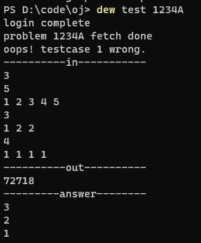
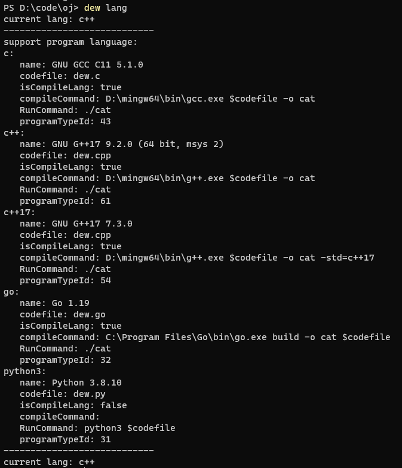
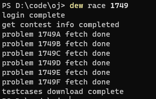
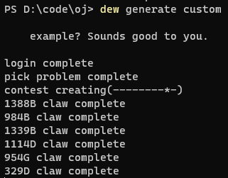

# dew

language: en/[zh](./doc/zh.md)

I'm glad to introduce dew command application for you. dew is a assistant which can help you test your program you will submit on codeforces. and a contest generator base on codeforces, which will help you better practice. you can use generate command a contest on mashup, whose problems is random.

## who need dew
1. Think test pre testcases is a troubleThink it's a hassle to repeat test cases and commits over and over.
2. You need more frequent practice, and you want to create more contest for you or your team.

## Install
I introduce two solution for you

### Download binary application and add into path
  1. open [releases](https://github.com/jaxleof/dew/releases)
  2. download zip
  3. decompress and move into path dir(if you don't know how to do it, the tutorial is for you: [tutorial](https://stackoverflow.com/questions/44272416/how-to-add-a-folder-to-path-environment-variable-in-windows-10-with-screensho))

### Or use go install command
  1. prerequisite: download golang(https://golang.google.cn/)
  2. use command `go install github.com/jaxleof/dew@latest`

## Feature
|name|describe|
|---|---|
|Cross platform|support windows, macos, linux and so on|
|multiple language|In theory all languages support|
|Quickly test and submit your program|use cli, you only need type some words, you can submit your program to codeforces|
|Support gym|not only contest, and gym|
|Template generator|you can store your template and generate it|
|Randomly pick problem for you|you can randomly pick one problem in codeforces, you can use it like a tool, everyday one problem|
|contest generator|you can generate a contest in mushups, if you need it for your team practice, the source of problems come from codeforces.|

## Some snapshot




## Basic Usage
```shell
# relax yourself and enjoy it, it's easy.
dew init
# waiting for your exploration
# original language is c++, you can use dew lang [language] change language program use.
# you can use dew lang command and check all language we support.
# write your program, we promise use dew.cpp as original submit code file.
# you can rewrite codefile in ./codeforces/config.yaml for different language
# codefile is code program will test and submit
vim dew.cpp # code your solution
dew test 1749A
dew submit 1749A

# race mode
dew race 1749
vim dew.cpp
dew test A
dew submit A

# random problem
dew random
dew test
dew submit

# specify a problem
dew problem 1749A
dew test
dew submit

# specify a file
dew test -f main.cpp
dew submit -f main.cpp
```

## dew command
```shell
Usage:
  dew [flags]
  dew [command]

Available Commands:
  completion  Generate the autocompletion script for the specified shell
  env         print config env
  generate    create a contest
  help        Help about any command
  init        init somethings
  lang        switch program language
  login       manually login
  open        a shortcut of opening codeforces website
  problem     open problem in codeforces
  race        set contest env
  random      alias to dew generate random
  status      a shortcut of opening codeforces status
  submit      submit problem
  template    generate template
  test        test problem
  tutorial    as the name says
  update      update problem data

Flags:
  -h, --help   help for dew

Use "dew [command] --help" for more information about a command.
```

## dew lang
This command will show current and total choice you can choose when nothing after command

If you want to change language, you can use dew lang \<language shortcut\>

example:
```shell
dew lang
dew lang python3
```

### how to config the language
1. Ensure you add your language command into path.
1. Let's see the config file, the location of it is "./codeforces/config.yaml",there is python3 configuration below.
```
python3: ## the shortcut, you can change to python3 when you use command "dew lang shortcut.
   name: Python 3.8.10 #the name, It's a hint
   codefile: dew.py ## the file dew will test and submit
   isCompileLang: false 
   compileCommand:
   RunCommand: python3 $codefile ##dew will run this command when test, $codefile is a variable, the dew will automatically replace it.
   programTypeId: 31 ## choose language when dew submit it to codeforces, you can query programTypeId dictionary at the bottom of this document.
```

## dew template
### create your template
1. mkdir in ./codeforces/template/{your template name}
2. You can write your template into ./codeforces/template/{your template name}/{template file name}
3. The program will show all template you create when you use -a flag `dew template -a`

### generate template
The program will create all template file in your template dir when you use template command, for instance `dew template hello`, all file in `./codeforces/hello/` will be created in current path.

If you don't fill anything after dew template, It's alias `dew template default`

hint:You can fill in more than one template name after the command like `dew template hello1 hello2`, all file in `./codeforces/hello1/` will be created first, distinct filename in `./codeforces/hello2/` will be created next.

The shortcut is `dew tmp`

example:
```shell
dew template -a
dew template
# or 
dew tmp -a
dew tmp


# please create template hello first.
dew template hello

# please create template basic and gcd first.
# if there are some filename is coincident same, files that appear after will not be created.
dew template basic gcd
```

## gym support
Use dew init apikey command first, you can obtain apikey in the https://codeforces.com/settings/api

## dew random
random command will specify a problem for your current rating \[+200, +300\], and you can specify a detailed rating or range rating you want.

example:
```shell
dew random
dew random 1800
dew random 1000 1200
```

## dew generate
1. this command can generate a contest on mushups, I built three option in it for you, you can use `dew generate div1` `dew generate div2` `dew generate div3` to generate.
2. If you hope custom difficult and filter some tag, you can use `dew generate custom` command, you can config it in "./codeforces/contestTemplate.json", dew will filter all problem satisfy thoes difficult, tag you choose in **good** field and without **bad** field

## proxy set
```shell
# after dew init
dew env -w proxy=http://127.0.0.1:41019
# replace http://127.0.0.1:41019 with your proxy server
```

## Development Plan
[link](https://miaonei.notion.site/45b6802260cb479896640a06d521c99e?v=83fa5f001404427fa645aa5009ada702)

## Technology Stack
1. [cobra](https://github.com/spf13/cobra)
2. [resty](https://github.com/go-resty/resty)

## programTypeId

```
<43>GNU GCC C11 5.1.0
<80>Clang++20 Diagnostics
<52>Clang++17 Diagnostics
<50>GNU G++14 6.4.0
<54>GNU G++17 7.3.0
<73>GNU G++20 11.2.0 (64 bit, winlibs)
<59>Microsoft Visual C++ 2017
<61>GNU G++17 9.2.0 (64 bit, msys 2)
<65>C# 8, .NET Core 3.1
<79>C# 10, .NET SDK 6.0
<9>C# Mono 6.8
<28>D DMD32 v2.091.0
<32>Go 1.19
<12>Haskell GHC 8.10.1
<60>Java 11.0.6
<74>Java 17 64bit
<36>Java 1.8.0_241
<77>Kotlin 1.6.10
<83>Kotlin 1.7.20
<19>OCaml 4.02.1
<3>Delphi 7
<4>Free Pascal 3.0.2
<51>PascalABC.NET 3.4.2
<13>Perl 5.20.1
<6>PHP 8.1.7
<7>Python 2.7.18
<31>Python 3.8.10
<40>PyPy 2.7.13 (7.3.0)
<41>PyPy 3.6.9 (7.3.0)
<70>PyPy 3.9.10 (7.3.9, 64bit)
<67>Ruby 3.0.0
<75>Rust 1.65.0 (2021)
<20>Scala 2.12.8
<34>JavaScript V8 4.8.0
<55>Node.js 12.16.3
<14>ActiveTcl 8.5
<15>Io-2008-01-07 (Win32)
<17>Pike 7.8
<18>Befunge
<22>OpenCobol 1.0
<25>Factor
<26>Secret_171
<27>Roco
<33>Ada GNAT 4
<38>Mysterious Language
<39>FALSE
<44>Picat 0.9
<45>GNU C++11 5 ZIP
<46>Java 8 ZIP
<47>J
<56>Microsoft Q#
<57>Text
<62>UnknownX
<68>Secret 2021
```
